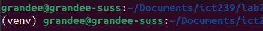
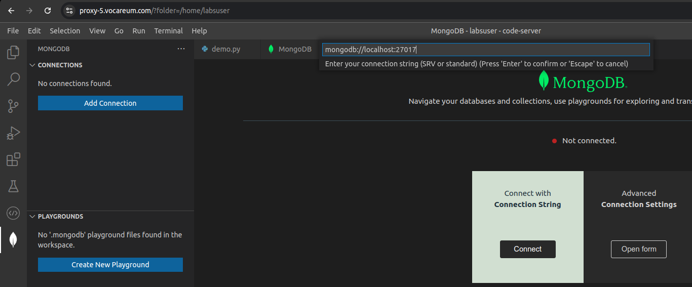
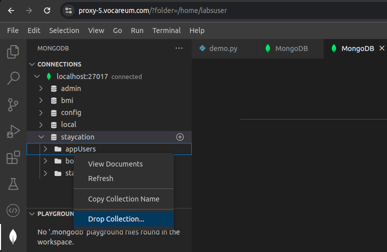

## setup virtual environment
```bash
python3 -m venv venv
source venv/bin/activate
pip install flask
```
The (venv) prefix in your shell indicates that you’re using a virtual environment.



---

## get the environment packages
```bash
pip freeze > requirements.txt
```

### setup the environment using `requirements.txt`
```bash 
python3 -m venv venv
source venv/bin/activate
pip install -r requirements.txt
```

---
## connect to MongoDB

Click on the MongoDB tab in the left sidebar and then click on the `Connect with connection string` button. And enter `mongodb://localhost:27017`



---

## drop collection

To delete a collection in MongoDB, right click on the collection and select `Drop Collection`.



---

## start Flask app

- If you are using local machine, make sure you have flask installed. 
- Create two files `app.py` and `start.sh` in your project directory.
- In `start.sh` file, add the following code:
```bash
export FLASK_APP=app.py; export PYTHONPATH=.; export FLASK_DEBUG=1;
flask run --host=0.0.0.0
```

---

- In `app.py` file, add the following code:
```python
from flask import Flask

app = Flask(__name__)

@app.route('/')
def home():
    return "welcome everyone"

@app.route("/greet/<name>")
def greet(name):
    return f"Hello, {name}!"
```

---

- Run the following command in your terminal:
```bash
sh start.sh
```
- You should see the following output on your terminal
```bash
$ flask --debug run
* Debug mode: on
WARNING: This is a development server. Do not use it in a production deployment. Use a production WSGI server instead. 	
* Running on http://127.0.0.1:5000
```
- Copy the above address and paste it in your browser. You should see the message `welcome everyone`